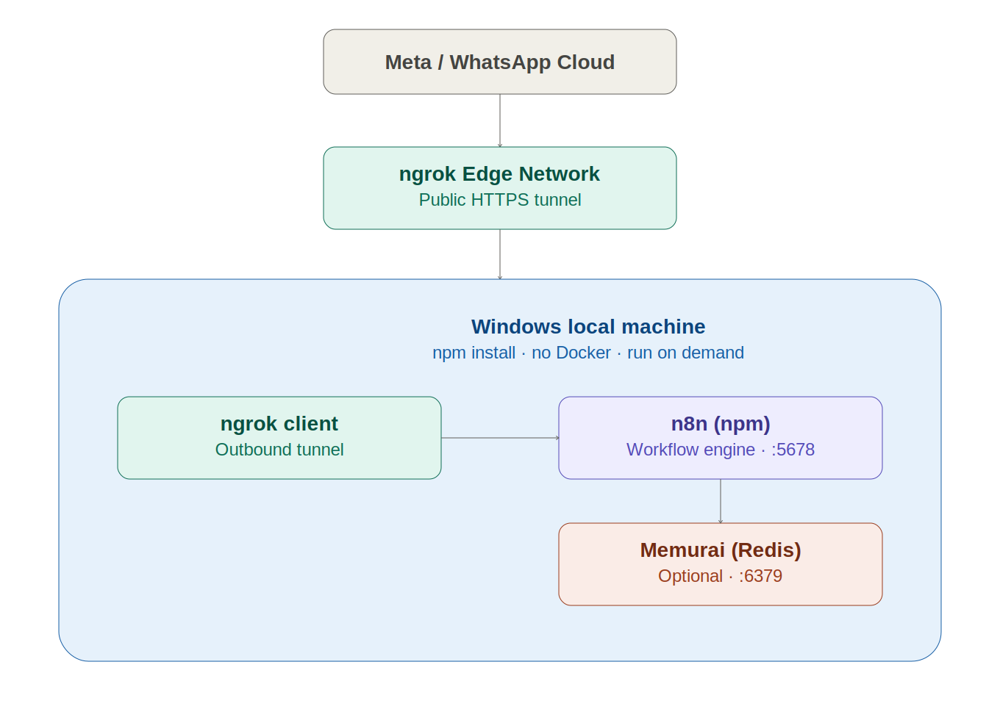

<div align="center">

# 🚀 n8n Windows Local Setup Guide

**Run n8n locally on Windows via npm — no Docker, no WSL2**

</div>

[+%2B+Auto-Start+Script;WhatsApp+Webhook+%2B+Backup+Restore+%2B+Credential+Fix)](https://git.io/typing-svg)

[](https://www.microsoft.com/windows)
[](https://nodejs.org)
[](https://n8n.io)
[-CB3837?style=for-the-badge&logo=npm&logoColor=white)](https://www.npmjs.com)
[](https://ngrok.com)
[-DC382D?style=for-the-badge&logo=redis&logoColor=white)](https://www.memurai.com)

> **A complete step-by-step guide to running n8n locally on Windows — via npm (no Docker, no WSL2), with ngrok static-domain webhooks, Memurai (Redis), an auto-start script, VPS backup restore, and Gmail/OAuth credential recovery.**

---

## 📌 Table of Contents

- [🏗️ Architecture](#️-architecture)
- [🛠️ Stack](#️-stack)
- [❓ Why npm instead of Docker on Windows](#-why-npm-instead-of-docker-on-windows)
- [✅ Prerequisites](#-prerequisites)
- [Part 1 — System Requirements](#part-1--system-requirements)
- [Part 2 — Install Node.js](#part-2--install-nodejs)
- [Part 3 — Install n8n (npm)](#part-3--install-n8n-npm)
- [Part 4 — Restore an Existing n8n Backup](#part-4--restore-an-existing-n8n-backup)
- [Part 5 — Environment Variables](#part-5--environment-variables)
- [Part 6 — ngrok Install & Static Domain](#part-6--ngrok-install--static-domain)
- [Part 7 — Memurai (Redis) for Windows](#part-7--memurai-redis-for-windows)
- [Part 8 — Auto-Start Script](#part-8--auto-start-script)
- [Part 9 — Backup & Restore (Local)](#part-9--backup--restore-local)
- [⚡ Quick Reference — All Commands](#-quick-reference--all-commands)
- [🔍 Useful Debug Commands](#-useful-debug-commands)
- [🔧 Troubleshooting](#-troubleshooting)
- [❔ FAQ](#-faq)
- [👤 Author](#-author)

---

## 🏗️ Architecture



### Layer Overview

| Layer | Components |
|---|---|
| **External** | WhatsApp / Meta Webhook · Google OAuth Callback |
| **HTTPS** | ngrok static (reserved) domain — outbound tunnel, works behind CGNAT / no public IP |
| **Local Machine** | n8n `:5678` (npm/Node.js, no container) · Memurai (Redis) `:6379` — native Windows service |
| **Data** | `%USERPROFILE%\.n8n` — workflows, credentials, encryption key, SQLite database |
| **Automation** | `start-n8n.bat` — one double-click starts n8n + ngrok together |

---

## 🛠️ Stack

| Component | Version / Detail | Purpose |
|---|---|---|
| **Windows** | 10 or 11 (Home or Pro — edition doesn't matter, no Hyper-V/WSL2 needed) | Host OS |
| **Node.js** | v20.19 – v24.x LTS | n8n runtime (npm install, no Docker) |
| **n8n** | Latest (`npm install -g n8n`) | Workflow automation engine (`:5678`) |
| **ngrok** | Free tier, reserved static domain | Public HTTPS tunnel for WhatsApp/Meta webhooks |
| **Memurai** | Developer Edition (free) | Native Windows Redis-compatible cache/queue (`:6379`) |
| **`start-n8n.bat`** | Custom batch script | Auto-starts n8n + ngrok with correct env vars in one click |

---

## ❓ Why npm instead of Docker on Windows

Most guides push Docker Desktop + WSL2 as the default for running n8n on Windows. That's a solid choice — **if** you have storage and RAM to spare. This guide exists for the opposite case:

| | Docker Desktop + WSL2 | npm (this guide) |
|---|---|---|
| Initial footprint | ~5–10 GB | ~500 MB – 1 GB |
| Growth over time | WSL2 virtual disk (`ext4.vhdx`) grows and rarely shrinks | Only your workflow data grows |
| Background resource use | Docker Desktop + WSL2 always running | Nothing runs unless you start it |
| Best for | 24/7 production-style local hosting | On-demand build/edit/test, storage-constrained machines |

If your machine has 100 GB+ free and you want production parity, Docker is still a fine choice. If you're tight on disk space and just need a local dev/test n8n instance, npm is dramatically lighter.

---

## ✅ Prerequisites

- Windows 10 or 11 (any edition)
- At least 5–10 GB free disk space
- An [ngrok](https://ngrok.com) account (free tier is enough)
- (Optional) An existing n8n backup (`.tar.gz` or `.zip` of your `.n8n` folder) if migrating from a VPS/cloud instance
- Basic comfort with copy-pasting PowerShell commands

---

## Part 1 — System Requirements

| Item | Minimum |
|---|---|
| RAM | 8 GB+ (16 GB recommended) |
| Free Storage | 5–10 GB minimum free (npm install uses ~1–2 GB; workflow data grows over time) |
| OS | Windows 10/11, Home or Pro |
| Internet | Required for install, ngrok tunnel, and any external API calls |

> ⚠️ **Docker/WSL2 is not required for this setup.** n8n's prebuilt binaries generally work fine on Windows without Visual Studio Build Tools — see [Troubleshooting](#-troubleshooting) if you hit a native-module edge case.

---

## Part 2 — Install Node.js

n8n supports **Node.js v20.19 through v24.x (inclusive)**. Newer "Current" releases outside that range may not work.

1. Download the latest **LTS** installer from [nodejs.org/en/download](https://nodejs.org/en/download) → Windows Installer (`.msi`), x64
2. Run the installer → Next → Accept License → Next → Next
3. ⚠️ **Uncheck** "Automatically install the necessary tools..." — this silently installs Chocolatey + Python + Visual Studio Build Tools (4–7 GB+), which is rarely needed and can eat your free space fast. See [Troubleshooting #1](#-1-node-installer-silently-installs-chocolatey--visual-studio-build-tools) if you missed this.
4. Install → Finish

Verify in a **new** PowerShell/CMD window:
```powershell
node -v
npm -v
```

---

## Part 3 — Install n8n (npm)

```powershell
npm install -g n8n
```

This takes a few minutes and prints a lot of output/warnings — that's normal.

**Verify:**
```powershell
n8n --version
npm list -g --depth=0
where n8n
```

`n8n@x.x.x` should appear exactly once (no duplicates).

**First test run:**
```powershell
n8n
```
After a moment, the editor opens at `http://localhost:5678`.

> ⚠️ **If you plan to restore an existing backup (Part 4), stop here with `Ctrl+C` and don't let n8n fully initialize first.** On first run, n8n generates a fresh `.n8n` folder with a brand-new random encryption key — restoring your backup afterward means overwriting that folder entirely, which this guide handles, but it's cleaner to restore before the first real run.

---

## Part 4 — Restore an Existing n8n Backup

> Starting fresh with no prior n8n instance? **Skip to [Part 5](#part-5--environment-variables)** — n8n will create its own `.n8n` folder automatically on first run.

### Why this matters

All n8n credentials (API keys, OAuth tokens) are stored **encrypted** in the database, using an `encryptionKey` stored in the `.n8n\config` file. Restoring the **entire** `.n8n` folder (config + database together) carries that key over, so **you don't need to reconnect any credentials.**

### Steps

**1. If n8n has already run once, move the fresh folder aside:**
```powershell
Rename-Item "$env:USERPROFILE\.n8n" "$env:USERPROFILE\.n8n_fresh_backup"
```

**2. Extract your backup** (check the real file extension first — `.tar`, `.tar.gz`, or `.zip`):
```powershell
mkdir "$env:USERPROFILE\.n8n"
tar -xzf "PATH-TO\n8n-backup.tar.gz" -C "$env:USERPROFILE\.n8n"
```
> Use `-xf` for plain `.tar`, `-xzf` for `.tar.gz`, or `Expand-Archive` for `.zip`.

**3. Verify the extraction:**
```powershell
Get-ChildItem "$env:USERPROFILE\.n8n"
```
You should see `config`, `database.sqlite`, `nodes`, `storage`.

**4. Run n8n and confirm credentials decrypt correctly:**
```powershell
n8n
```
Open `http://localhost:5678`, check your restored workflows, and open a credential node — if it does **not** show *"Could not be decrypted"*, the restore succeeded.

---

## Part 5 — Environment Variables

To make n8n consistently identify itself by your public ngrok domain — for webhooks, the editor, **and** OAuth redirects — set these before starting n8n:

| Variable | Value | Purpose |
|---|---|---|
| `N8N_HOST` | `your-static-domain.ngrok-free.dev` | n8n identifies itself as this domain everywhere |
| `N8N_PROTOCOL` | `https` | All generated URLs use https |
| `WEBHOOK_URL` | `https://your-static-domain.ngrok-free.dev/` | Webhook/API/OAuth callback base URL |
| `N8N_SECURE_COOKIE` | `false` | Prevents login/cookie issues when accessing via `http://localhost` while n8n believes it's https |

> ⚠️ For Google OAuth credentials (Gmail, Sheets, etc.), add this redirect URI in Google Cloud Console:
> ```
> https://your-static-domain.ngrok-free.dev/rest/oauth2-credential/callback
> ```

These are all set inside the [auto-start script](#part-8--auto-start-script) in Part 8 — no need to set them separately.

---

## Part 6 — ngrok Install & Static Domain

### Why ngrok

To receive WhatsApp/Meta webhooks, n8n needs a public HTTPS URL. A home/office Windows machine usually sits behind a private IP — often behind CGNAT, meaning there's no real public IP to port-forward to at all. ngrok solves this with an **outbound** tunnel, so no router configuration or public IP is required.

### 1 — Install
Install via Microsoft Store (search "ngrok"), or download from [ngrok.com/download](https://ngrok.com/download).
```powershell
ngrok version
```

### 2 — Add your authtoken
Copy it from [dashboard.ngrok.com/get-started/your-authtoken](https://dashboard.ngrok.com/get-started/your-authtoken):
```powershell
ngrok config add-authtoken YOUR_AUTHTOKEN
```

### 3 — Reserve a static domain
[dashboard.ngrok.com/domains](https://dashboard.ngrok.com/domains) → **New Domain** → copy your free permanent domain (`xxxxx.ngrok-free.dev`).

> 📌 **This static domain is tied to your ngrok *account*, not any specific machine.** You can run it from a VPS or from this local machine interchangeably — just not both **at the same time** (only one active tunnel per domain).

### 4 — Test it manually
```powershell
ngrok http --url=your-static-domain.ngrok-free.dev 5678
```
You should see `Session Status: online` and the correct forwarding line.

### How ngrok and n8n actually connect

n8n and ngrok are two independent programs — they don't talk to each other directly. Here's the full request path:

1. **n8n** listens on `localhost:5678` (invisible outside the machine)
2. **ngrok client** opens an **outbound** secure connection to ngrok's cloud — this is what bypasses your router/firewall/CGNAT, since the connection originates from inside your network
3. `ngrok http --url=your-domain 5678` tells ngrok: *"forward anything hitting this domain to my local port 5678"* — this line is the only real link between the two processes
4. WhatsApp/Meta sends a request to `https://your-domain.ngrok-free.dev/webhook/...` → it hits ngrok's cloud → travels through the tunnel → arrives at `localhost:5678` → n8n processes it
5. `N8N_HOST` / `WEBHOOK_URL` (Part 5) tell n8n what to call *itself* when generating webhook/OAuth URLs — without them, n8n would show `localhost` URLs that nobody outside your machine can reach

---

## Part 7 — Memurai (Redis) for Windows

If any of your workflows use a Redis credential/node (e.g., message queueing for a chatbot), you need a Redis-compatible server running locally. **Memurai** is Redis's official native-Windows compatibility layer — no Docker/WSL2 required.

1. Download the **Developer Edition** (free, non-production use) from [memurai.com/get-memurai](https://www.memurai.com/get-memurai)
2. Install (`.msi`, default settings — it installs as a Windows Service and starts automatically on boot)
3. Verify:
```powershell
memurai-cli ping
```
Should return `PONG`.

**n8n Redis credential:** Host `localhost`, Port `6379`, Password blank.

---

## Part 8 — Auto-Start Script

Create `start-n8n.bat` on your Desktop:

```bat
@echo off
set N8N_HOST=your-static-domain.ngrok-free.dev
set N8N_PROTOCOL=https
set WEBHOOK_URL=https://your-static-domain.ngrok-free.dev/
set N8N_SECURE_COOKIE=false
set EXECUTIONS_DATA_PRUNE=true
set EXECUTIONS_DATA_MAX_AGE=168
set N8N_LOG_FILE_COUNT_MAX=3
set N8N_LOG_FILE_SIZE_MAX=5
start "n8n" cmd /k "n8n"
timeout /t 8
start "ngrok" cmd /k "ngrok http --url=your-static-domain.ngrok-free.dev 5678"
```

| Variable | Effect |
|---|---|
| `N8N_HOST` / `N8N_PROTOCOL` / `WEBHOOK_URL` / `N8N_SECURE_COOKIE` | See [Part 5](#part-5--environment-variables) |
| `EXECUTIONS_DATA_PRUNE` + `EXECUTIONS_DATA_MAX_AGE=168` | Auto-deletes execution history older than 7 days |
| `N8N_LOG_FILE_COUNT_MAX` + `N8N_LOG_FILE_SIZE_MAX` | Caps log files at 3 files × 5 MB — old logs auto-rotate out |

Double-click `start-n8n.bat` to launch n8n + ngrok together.

> ℹ️ **Firewall prompt:** the first time you run n8n or ngrok, Windows Defender Firewall may ask for network access — click **Allow**.
>
> 🔌 **To stop:** close both spawned windows directly (n8n and ngrok are not Windows services — they don't auto-start on boot; only Memurai does).
>
> ✅ **Verify it worked:** open any Webhook node in n8n and check the **Production URL** tab — it should show your ngrok domain, not `localhost`.

---

## Part 9 — Backup & Restore (Local)

Everything n8n needs — workflows, credentials, encryption key — lives in one folder:
```
%USERPROFILE%\.n8n
```

**Backup:**
```powershell
Compress-Archive -Path "$env:USERPROFILE\.n8n" -DestinationPath "$env:USERPROFILE\Documents\n8n-local-backup-$(Get-Date -Format yyyyMMdd).zip"
```

This zip is everything you need to restore on this machine or any other — see [Part 4](#part-4--restore-an-existing-n8n-backup).

---

## ⚡ Quick Reference — All Commands

```powershell
# 1. Node.js — verify
node -v
npm -v

# 2. Install n8n
npm install -g n8n
n8n --version

# 3. ngrok
ngrok config add-authtoken YOUR_AUTHTOKEN
ngrok http --url=your-static-domain.ngrok-free.dev 5678

# 4. Memurai (Redis)
memurai-cli ping

# 5. Backup
Compress-Archive -Path "$env:USERPROFILE\.n8n" -DestinationPath "$env:USERPROFILE\Documents\n8n-backup.zip"

# 6. Restore
Expand-Archive -Path "n8n-backup.zip" -DestinationPath "$env:USERPROFILE\.n8n"
```

---

## 🔍 Useful Debug Commands

| Task | Command |
|---|---|
| Check disk space | `Get-PSDrive C` |
| n8n version / path | `n8n --version` / `where n8n` |
| List global npm packages | `npm list -g --depth=0` |
| Check ngrok version | `ngrok version` |
| Test Redis (Memurai) | `memurai-cli ping` |
| Check installed programs (registry) | `Get-ItemProperty HKLM:\Software\Wow6432Node\Microsoft\Windows\CurrentVersion\Uninstall\*` |
| Check if a folder still exists | `Test-Path "C:\path\to\folder"` |

---

## 🔧 Troubleshooting

### ❌ 1. Node installer silently installs Chocolatey + Visual Studio Build Tools
**Cause:** The "Automatically install the necessary tools" checkbox was left checked during Node.js install — this can consume 4–7 GB+.

**Fix:**
```powershell
taskkill /F /IM vs_installer.exe /T
```
Restart your PC, then uninstall "Visual Studio Build Tools" and "Visual Studio Installer" from **Settings → Apps**. For anything installed via Chocolatey:
```powershell
choco uninstall <package-name> -y
```
Confirm space was reclaimed with `Get-PSDrive C`, and delete any small leftover folders (`C:\Program Files (x86)\Microsoft Visual Studio`, `C:\ProgramData\chocolatey`) once confirmed empty/tiny.

---

### ❌ 2. `npm install -g n8n` warns about "install scripts not covered by allowScripts"
This is a newer npm security feature — some native packages (like `sqlite3`) may have their install scripts skipped. This doesn't always cause problems — run `n8n` and check if the editor loads correctly first.

---

### ❌ 3. `tar -xf` fails with "Failed to open archive"
**Cause:** Windows Explorer often hides file extensions, so a `.tar.gz` file may *look* like `.tar`.

**Fix:** Check the real extension first with `Get-ChildItem`, then match the flag: `.tar` → `-xf`, `.tar.gz` → `-xzf`.

---

### ❌ 4. The same webhook message keeps re-triggering executions
**Cause:** If a workflow errors out internally (invalid JSON, API rate-limit, etc.), n8n can't send Meta/WhatsApp a timely `200 OK`. Meta then **redelivers the same message** on its own retry schedule — this is Meta's behavior, not n8n's.

**Fix:** Fix the underlying node error first. Once the workflow completes successfully, Meta gets its `200 OK` and stops retrying.

---

### ❌ 5. AI node (e.g. Google Gemini) prints "Please retry in X seconds" repeatedly
**Cause:** n8n's LangChain-based AI nodes have a built-in retry mechanism at the library level (not exposed as an n8n node setting) that automatically retries failed API calls (e.g. 429 rate-limit errors) a few times before giving up.

**Fix:** Resolve the root cause (e.g. API quota) so retries are never triggered. For full control, use an **HTTP Request** node to call the API directly instead of the LangChain wrapper.

---

### ❌ 6. Deprecation warnings / database timeouts on first startup
n8n commonly prints these on a cold start — all are safe to ignore:
- Deprecation notices about future default changes (`N8N_RUNNERS_TASK_TIMEOUT`, etc.)
- A few `Database ping failed` lines before `Database connection recovered`
- `Failed to refresh MCP registry` — n8n's template-gallery fetch timing out, no functional impact

You're good once you see:
```
Editor is now accessible via:
http://localhost:5678
```

---

## ❔ FAQ

**Can I run n8n locally on Windows without Docker?**
Yes — n8n installs cleanly via `npm install -g n8n` on Windows 10/11 (Node.js v20.19–v24.x), with no Docker Desktop or WSL2 required. This is lighter on disk space and doesn't need a virtual machine layer.

**How do I connect a local n8n instance to a WhatsApp/Meta webhook?**
Use ngrok with a free reserved static domain. It creates an outbound tunnel to your local `localhost:5678`, so Meta's webhook can reach your machine even behind a home router or CGNAT — no port forwarding or public IP needed.

**Does ngrok work if my ISP doesn't give me a public IP (CGNAT)?**
Yes. Since ngrok initiates an outbound connection from your machine to ngrok's cloud, it works regardless of NAT type — DuckDNS + port-forwarding, by contrast, requires a real public IP reaching your router, which most home/mobile ISPs don't provide.

**Will I lose my n8n credentials when moving from a VPS to a local Windows setup?**
No — as long as you restore the entire `.n8n` folder (not just the database), including the `config` file that holds the encryption key. See [Part 4](#part-4--restore-an-existing-n8n-backup).

**Do I need Redis to run n8n locally on Windows?**
Only if your workflows use Redis nodes/credentials (common in message-queueing chatbot setups). [Memurai](https://www.memurai.com) provides a free, native Windows-compatible Redis server with no Docker required.

**Why does n8n keep re-running the same webhook execution?**
That's usually Meta/WhatsApp redelivering a webhook because your workflow didn't return `200 OK` in time due to an internal node error — not an n8n bug. See [Troubleshooting #4](#-4-the-same-webhook-message-keeps-re-triggering-executions).

---

## 👤 Author


### Muhammad Antor

**AI Automation Engineer | AutomateIQ Labs ⚡**

*Building self-hosted AI systems and automation solutions*

[](https://www.linkedin.com/in/muhammad-antor)
[](https://www.facebook.com/automateiq.labs/)
[](mailto:muhammadantor71@gmail.com)
[](https://github.com/muhammadantor)

---

**⭐ If this guide helped you, please give it a star!**

*Built with ❤️ by AutomateIQ Labs · Bangladesh*
